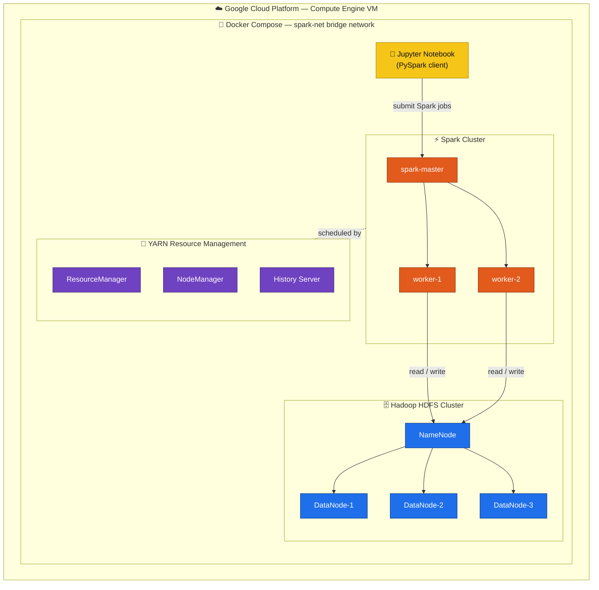

# COVID-19 Big Data Pipeline — HDFS · Spark · Docker on GCP

> **🏆 Runner-Up — UQ Cloud Computing "Best Project" Competition (2022)**
>
> An end-to-end big data platform that ingests **~306K COVID-19 records** into a
> distributed **Hadoop HDFS + Apache Spark** cluster, runs analytical **Spark SQL**
> queries at scale, and forecasts future case counts with **machine learning** —
> all fully containerized with **Docker** and deployed on **Google Cloud Platform VMs**.

<p>
  
  
  
  
  
  
  
</p>

🎥 **[Watch the 3-minute competition demo →](https://www.dropbox.com/scl/fi/bdz680sulrda294zcgk1m/Yingzheng-Cai.mp4?rlkey=d06o1oe44joda16j8q7b5fxdu&st=uy829s6g&dl=0)**

---

## Background

To an unfortunate extent, we all live in the era of COVID-19 — daily life, travel,
and the international economy and trade have all been affected to varying degrees.

Fortunately, to help people better track and understand the global pandemic situation
and trends, **Covid Stats ZeroToHero** was built. More importantly, it applies
**machine learning models trained on big data** to forecast confirmed COVID-19 case
counts across the world.

## Why this project stands out

- **Real distributed systems, not a toy.** Provisions a genuine multi-node cluster —
  1 NameNode + **3 DataNodes** for HDFS, a Spark master with **2 workers**, plus YARN
  ResourceManager/NodeManager and History Server — orchestrated by a single Docker Compose file.
- **Scales to hundreds of thousands of records.** COVID-19 case data is loaded straight
  from **HDFS** (`hdfs://namenode:9000/...`) and processed in parallel with PySpark.
- **From raw data to prediction.** One pipeline covers the full lifecycle: distributed
  ETL → Spark SQL analytics → visualization → ML forecasting validated against real WHO data.
- **Cloud-native & reproducible.** The whole stack spins up with one command locally or on a
  **GCP Compute Engine VM** — infrastructure captured entirely as code.

## Architecture



## Tech stack

| Layer                | Technology                                                        |
| -------------------- | ----------------------------------------------------------------- |
| **Distributed storage** | Hadoop **HDFS** 3.2.1 (NameNode + 3 DataNodes)                  |
| **Compute engine**   | Apache **Spark** 3.0.0 (master + 2 workers), **Spark SQL**, PySpark |
| **Resource mgmt**    | Hadoop **YARN** (ResourceManager, NodeManager, History Server)    |
| **Containerization** | **Docker** & Docker Compose (9-service cluster, one bridge network) |
| **Cloud**            | **Google Cloud Platform** — Compute Engine VMs                     |
| **Analysis / ML**    | Jupyter, pandas, NumPy, **scikit-learn**, Matplotlib, Seaborn, Plotly |

## What the pipeline does

**1. Distributed ETL (PySpark)** — Loads raw CSV from HDFS, drops null rows, sanitizes
column names, and casts types (string → `DateType`/`TimestampType`) to prevent
"garbage in, garbage out."

**2. Analytics at scale (Spark SQL)** — Five queries over the full dataset:
- COVID-19 trend analysis for China (confirmed / recovered / deaths over time)
- Top-20 provinces by active cases, with outlier handling (Hubei)
- Country ranking: best vs. worst epidemic control by death ratio & recovery rate
- Countries that kept confirmed cases under 500 in the first year
- Global one-year distribution analysis via box plots

**3. Machine learning forecast (scikit-learn)** — Polynomial regression models China's
confirmed-case curve and forecasts the next 10 days, validated against **live WHO figures**.

## Results

| Model / task                                         | RMSE     |
| ---------------------------------------------------- | -------- |
| Polynomial regression — fit on training sample        | 793.56   |
| Polynomial regression — fit on full sample            | 2,522.34 |
| **10-day forward forecast vs. actual WHO data**       | **21.43** |

The 10-day forecast tracked real-world WHO numbers within an RMSE of ~21 cases — the
model generalized accurately beyond its training window.

## Run it yourself

**Prerequisites:** Docker & Docker Compose (locally, or on a GCP Compute Engine VM).

```bash
# 1. Launch the full HDFS + Spark + Jupyter cluster
docker compose -f docker-compose_hdfs_spark.yml up -d

# 2. Load the dataset into HDFS
docker exec -it namenode \
  hdfs dfs -put /home/nbs/covid_19_data.csv /covid_19_data.csv

# 3. Open Jupyter and run the notebook
#    → http://localhost:8888   (INFS3208 Project Source Code.ipynb)
```

**Web UIs:** HDFS NameNode `:4040` · Spark master `:8080` · YARN `:8089` · Jupyter `:8888`

> Note: `docker-compose_hdfs_spark.yml` references a `hadoop.env` file for cluster
> configuration; supply standard [bde2020 Hadoop](https://github.com/big-data-europe/docker-hadoop)
> environment values.

## Repository contents

| File                                   | Description                                        |
| -------------------------------------- | -------------------------------------------------- |
| `INFS3208 Project Source Code.ipynb`   | Full pipeline: ETL, Spark SQL analytics, ML forecast |
| `docker-compose_hdfs_spark.yml`        | 9-service HDFS + Spark + Jupyter cluster definition |
| `covid_19_data.csv`                    | Source dataset (~306K records)                      |
| `Future_10_days_confirmed_from_WHO.csv`| WHO ground-truth data for forecast validation       |

---

*Built for INFS3208 Cloud Computing at the University of Queensland (2022). Licensed under MIT.*
